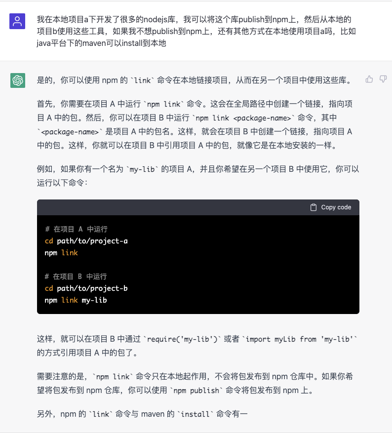
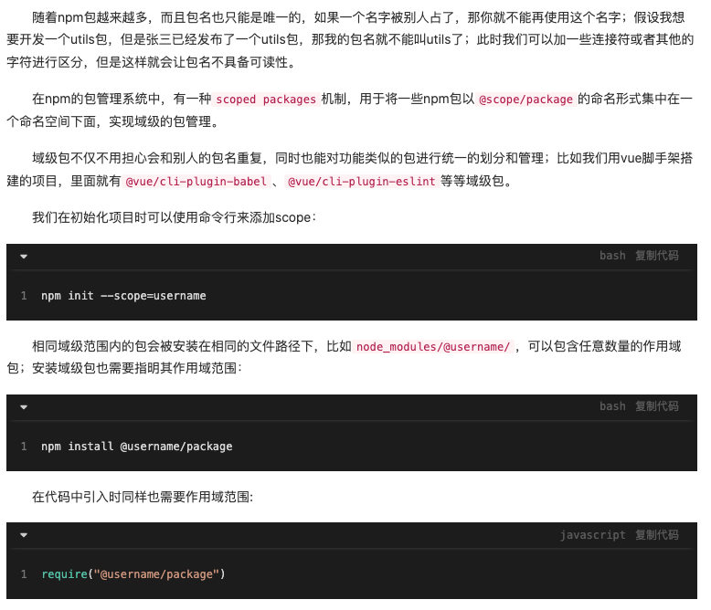

1. 创建npm账号：创建npm账号 - 访问[npm官方网站](https://www.npmjs.com/)，点击"Sign Up"按钮创建一个新的账号。

2. 使用`npm init`初始化npm项目，如果项目使用域级包，则需要加上--scope：`npm init -y --scope=@scope-name`

   ```bash
   npm init -y --scope=@hellooo-stack
   ```

3. 在package.json文件中声明包的入口文件，如：

   ```json
   {
     "main": "src/index.js"
   }
   ```

4. 使用`npm login`登录，如果无法登录，报"Public registration is not allowed"之类的错误，请将registry改回官方镜像源：`npm config set registry [<https://registry.npmjs.org>](<https://registry.npmjs.org/>)`

5. 使用`npm publish`发布包：如果是域级包，则需要用`npm publish --access public`。当然，如果不加public，就是private的仓库，需要给钱。

版本升级：修改代码后，发布新版本的包需要使用新的版本号，具体步骤如下：

1. 修改代码
2. git提交代码
3. `npm version [major, minor, patch]`：会自动修改package.json文件，在版本号对应的位置上加1，然后创建一个新的git commit。

# 其他

## 本地引用新版本包

不发布新版本到npm仓库，在本地使用新版本包：



## 域级包



## 添加.npmignore


# 参考资料

1. https://juejin.cn/post/7052307032971411463
2. https://juejin.cn/post/7131406856240496647
3. https://medium.com/@agoehring/how-to-package-and-import-a-local-javascript-library-7ed0cb23dbb1
4. https://docs.npmjs.com/creating-node-js-modules
5. https://xieyufei.com/2021/01/28/Package-Tool-Compare.html
6. https://juejin.cn/post/6844903749199069197
7. https://www.ruanyifeng.com/blog/2022/05/rollup.html
