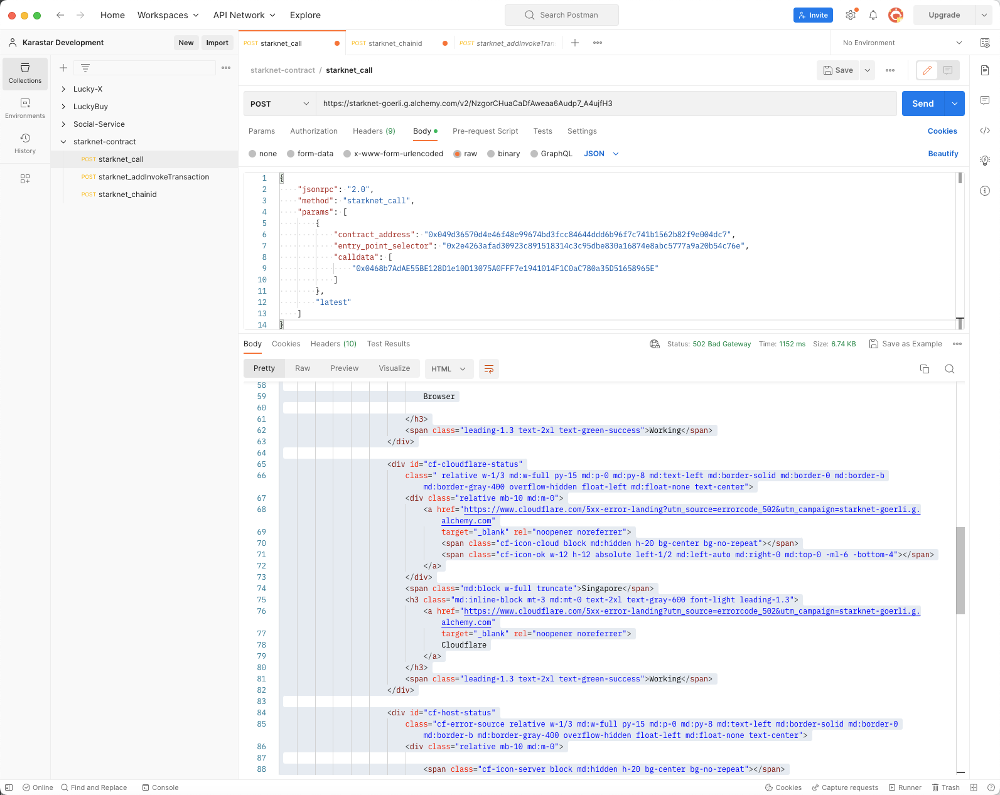
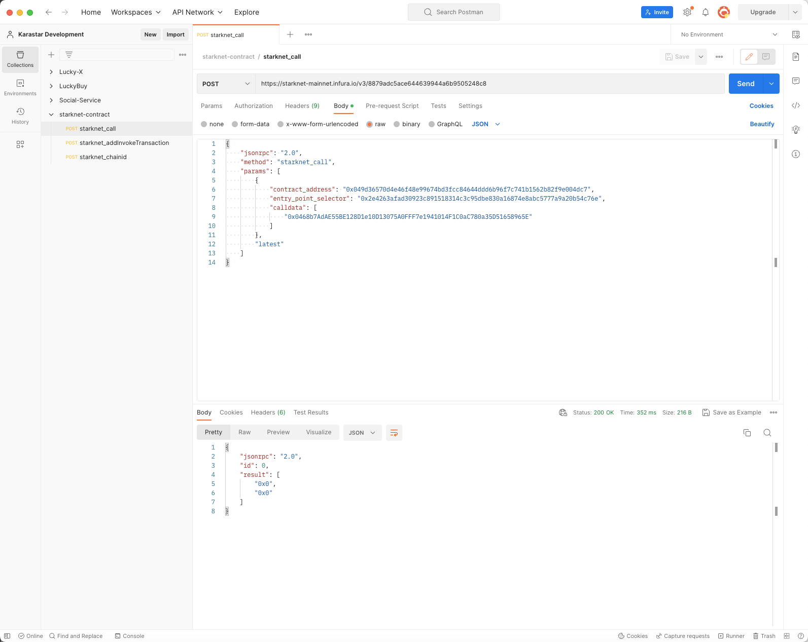
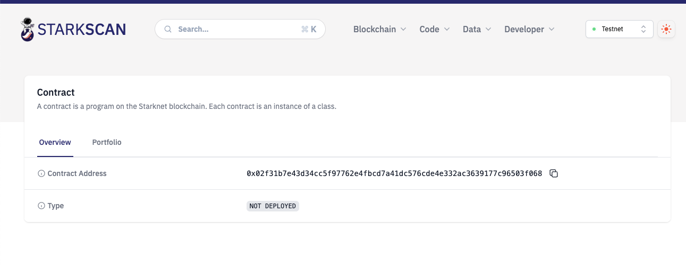
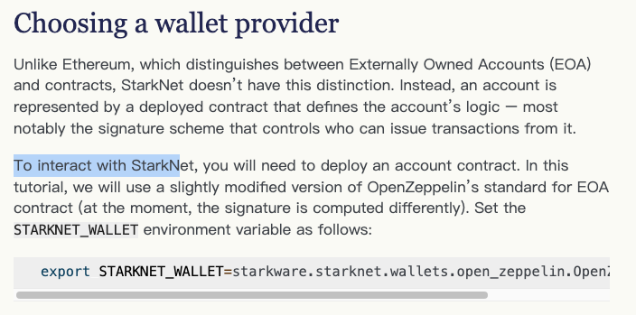
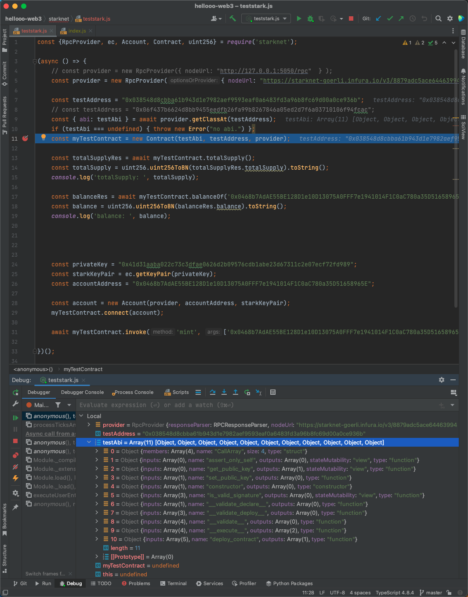
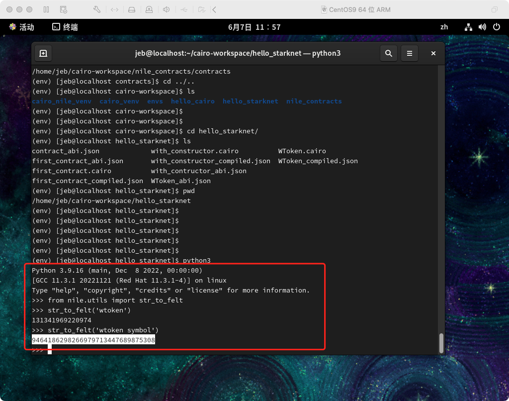

# Starknet合约开发入门

# 一、基础概念

## 1.1 什么是starknet

[https://www.starknet.io/en](https://www.starknet.io/en)

## 1.2 什么是L2

[什么是l2](https://www.google.com/search?q=%E4%BB%80%E4%B9%88%E6%98%AFl2&newwindow=1&sxsrf=APwXEde_ruRaGTzy1NC4YhK9TWa8sdxqsg%3A1687165723284&ei=GxuQZKrvEOny4-EPwM2dmAk&ved=0ahUKEwjq6POM_s7_AhVp-TgGHcBmB5MQ4dUDCA8&uact=5&oq=%E4%BB%80%E4%B9%88%E6%98%AFl2&gs_lcp=Cgxnd3Mtd2l6LXNlcnAQAzIFCAAQgAQyBQgAEIAEMgUIABCABDoHCCMQsAMQJzoKCAAQRxDWBBCwAzoICC4QigUQkQI6CwgAEIAEELEDEIMBOhEILhCABBCxAxCDARDHARDRAzoLCAAQigUQsQMQgwE6FgguEIoFEJECEJcFENwEEN4EEOAEGAE6BwgAEIoFEEM6FgguEIoFEMcBEK8BEJgFEJ4FEJkFEEM6DQgAEIoFELEDEIMBEEM6DggAEIoFELEDEIMBEJECOgQIABADOggIABCABBDJAzokCC4QigUQxwEQrwEQmAUQngUQmQUQQxCXBRDcBBDeBBDgBBgBOgsILhCKBRCxAxCRAjoRCC4QgwEQxwEQsQMQ0QMQgAQ6CgguEIoFENQCEEM6DggAEIAEELEDEIMBEJIDOggIABCKBRCSAzoZCC4QigUQsQMQkQIQlwUQ3AQQ3gQQ4AQYAToFCC4QgAQ6CwguEIAEEMcBEK8BOhMILhCABBCXBRDcBBDeBBDfBBgBOgcIIxDqAhAnOhUIABADEI8BEOoCELQCEIwDEOUCGAI6FQguEAMQjwEQ6gIQtAIQjAMQ5QIYAjoECCMQJzoHCAAQgAQQCkoECEEYAFD9BljjJmC4KGgNcAF4AYAB3wGIAZUQkgEGMC4xMy4xmAEAoAEBsAEUwAEByAEJ2gEGCAEQARgU2gEGCAIQARgL&sclient=gws-wiz-serp)

## 1.3 什么是zkEVM

[what is zkEVM](https://blog.thirdweb.com/zkevm/#:~:text=A%20zkEVM%20(which%20stands%20for,scalability%20to%20Ethereum%2Dbased%20applications.)

## 1.4 什么是账户抽象

[https://ethereum.stackexchange.com/questions/146974/how-to-start-with-erc-4337](https://ethereum.stackexchange.com/questions/146974/how-to-start-with-erc-4337)

[https://github.com/eth-infinitism/account-abstraction/tree/6dea6d8752f64914dd95d932f673ba0f9ff8e144](https://github.com/eth-infinitism/account-abstraction/tree/6dea6d8752f64914dd95d932f673ba0f9ff8e144)

[https://docs.stackup.sh/](https://docs.stackup.sh/)

[https://learnblockchain.cn/article/5946](https://learnblockchain.cn/article/5946)

[https://learnblockchain.cn/article/5930](https://learnblockchain.cn/article/5930)

[https://learnblockchain.cn/article/5426](https://learnblockchain.cn/article/5426)

# 二、环境搭建及合约部署

## 2.1 cairo编译环境搭建

starknet合约使用cairo语言编写，首先得将.cairo文件编译成ABI JSON，之后才能部署合约。以下步骤展示如何安装cairo编译器及完成一个简单cairo源文件的编译。参考自：[https://docs.starknet.io/documentation/getting_started/environment_setup/](https://docs.starknet.io/documentation/getting_started/environment_setup/)

1. 搭建环境：
    
    ```bash
    # 1. 创建工作目录
    cd
    mkdir cairo-workspace
    cd cairo-workspace
    
    # 2. 创建python虚拟运行环境
    python3.9 -m venv cairo_venv
    
    # 3. 激活虚拟运行环境，并在虚拟运行环境下执行下述步骤
    source cairo_venv/bin/activate
    
    # 4. 安装依赖库
    # 1) gmp
    # ubuntu
    sudo apt install -y libgmp3-dev
    # centos
    sudo yum install -y gmp-devel
    # 2) pip install ecdsa fastecdsa sympy
    pip install ecdsa fastecdsa sympy
    # a. 如果报错：error: command 'gcc' failed: No such file or directory
    #    安装gcc：centos：sudo dnf install gcc
    # b. 如果报错：Python.h：没有那个文件或目录
    #    安装：sudo yum install python3-devel
    
    # 5. 安装cairo cli
    pip uninstall cairo-lang
    pip install cairo-lang
    
    # 6. 检测cairo cli是否安装成功
    starknet --version
    
    # 7. 安装cairo代码编译器
    git clone https://github.com/starkware-libs/cairo/ .cairo
    cd .cairo/
    git checkout tags/v1.0.0-alpha.6
    # 如果没有cargo包管理器，需要安装后再执行该命令
    cargo build --all --release
    # 将cairo的bin设置到path
    export PATH="$HOME/cairo-workspace/.cairo/target/release:$PATH"
    # 如果需要永久生效，编辑.bash_profile或.zshrc, 添加
    PATH="$HOME/cairo-workspace/.cairo/target/release:$PATH"
    ```
    
2. 编译cairo源文件：
    
    ```bash
    # cairo 0 要废了，直接用cairo-compile --version看下有东西出来就OK了
    ```
    

## 2.2 部署账户

在部署合约之前得先有账户，starknet账户抽象使用的是ERC4337协议，部署账户流程如下：

```bash
# 1. 进入cairo工作目录
cd cairo-workspace

# 2. 创建环境变量目录，可避免每次调用'starknet'命令时都需要传递对应参数
mkdir envs
cd envs
vim starknet-cli.env
# 填入以下内容并保存
# export STARKNET_NETWORK=alpha-goerli
# export CAIRO_COMPILER_DIR=$HOME/cairo-workspace/.cairo/target/release/
# export CAIRO_COMPILER_ARGS=--add-pythonic-hints
# export STARKNET_WALLET=starkware.starknet.wallets.open_zeppelin.OpenZeppelinAccount

# 3. 应用starknet-cli.env内保存的变量.
# 每次登陆shell执行starknet命令时都需要执行
source starknet-cli.env

# 4. 开始创建账号
# 回到工作目录并进入python虚拟环境
cd ..
source cairo_venv/bin/activate
# 创建名为 'jebs_account1'的账号
starknet new_account --account jebs_account1
# 输出：
# Account address: 0x02f31b7e43d34cc5f97762e4fbcd7a41dc576cde4e332ac3639177c96503f068
# Public key: 0x060ab6af7b8d121a2d05548f494580dfe222e59b03c82bfa76ce7eacb429dab0
# Move the appropriate amount of funds to the account, and then deploy the account by invoking the 'starknet deploy_account' command.
# NOTE: This is a modified version of the OpenZeppelin account contract. The signature is computed differently.

# 5. 从有钱的地址往上面地址打钱，大概0.001即可，完事后执行第6步
# 记得先去浏览器看下transaction，accepted后才执行第6步，否则这个账户就废了
# 可以用这个命令估算下fee price
starknet deploy_account --simulate --account=jebs_account1 --network=alpha-goerli

# 6. 部署账户
starknet deploy_account --account=jebs_account1 --network=alpha-goerli
# 输出
# Sending the transaction with max_fee: 0.000005 ETH (4755300271053 WEI).
# Sent deploy account contract transaction.
# Contract address: 0x02f31b7e43d34cc5f97762e4fbcd7a41dc576cde4e332ac3639177c96503f068
# Transaction hash: 0x42fe91abb5bca79fcd14603ed4b4853cd35a83f0a50e13dad3a599a79012231

# 7. 拿到第6步transaction hash，如果状态变为accepted就说明ok了
```

## 2.3 部署及调用合约

1. 编写.cairo合约代码：
    
    ```
    %lang starknet
    
    from starkware.cairo.common.cairo_builtins import HashBuiltin
    
    // Define a storage variable.
    @storage_var
    func balance() -> (res: felt) {
    }
    
    // Increases the balance by the given amount.
    @external
    func increase_balance{
        syscall_ptr: felt*,
        pedersen_ptr: HashBuiltin*,
        range_check_ptr,
    }(amount: felt) {
        let (res) = balance.read();
        balance.write(res + amount);
        return ();
    }
    
    // Returns the current balance.
    @view
    func get_balance{
        syscall_ptr: felt*,
        pedersen_ptr: HashBuiltin*,
        range_check_ptr,
    }() -> (res: felt) {
        let (res) = balance.read();
        return (res=res);
    }
    ```
    
2. 编译合约：
    
    ```bash
    starknet-compile-deprecated first_contract.cairo --output first_contract_compiled.json --abi first_contract_abi.json
    ```
    
3. 声明合约：
    
    ```bash
    # 查看环境变量是否设置
    echo $STARKNET_NETWORK
    
    # 若没有设置，请用命令参数的方式指定
    
    starknet declare --contract first_contract_compiled.json --deprecated --account=jebs_account1
    
    # 输出
    # Sending the transaction with max_fee: 0.000001 ETH (1378311599773 WEI).
    # DeprecatedDeclare transaction was sent.
    # Contract class hash: 0xd267e6a11eed91056994aa6a89b20ca2fa989385e88429b57a9fdce84c58e6
    # Transaction hash: 0x20b6c9469b6444eac1a8de7b0fce1f62ddb5dfc1f50933015379a6c90fa4249
    ```
    
4. 部署合约：
    
    ```bash
    starknet deploy --class_hash 0xd267e6a11eed91056994aa6a89b20ca2fa989385e88429b57a9fdce84c58e6 --account=jebs_account1
    # Sending the transaction with max_fee: 0.000003 ETH (3426529437062 WEI).
    # Invoke transaction for contract deployment was sent.
    # Contract address: 0x02e06ac28dd788ff7a71a38d283c46d458893fa6eebb23f18c4c515ec44eecd7
    # Transaction hash: 0x565c97b2af76e2a0166a876273a8f3713dde2b4c778dd3af3df9988ce27e4f8
    
    # 参数是否需要用str_to_felt来算不太记得了，后面如果不ok可以试试
    # 如果需要传构造参数，请加上--inputs 如：starknet deploy --inputs 1 ....
    ```
    
5. 调用合约：
    - 写入
        
        ```bash
        starknet invoke --address 0x02e06ac28dd788ff7a71a38d283c46d458893fa6eebb23f18c4c515ec44eecd7 --abi first_contract_abi.json --function increase_balance --inputs 1234 --account jebs_account1
        
        # 输出
        # Sending the transaction with max_fee: 0.000004 ETH (4089836100665 WEI).
        # Invoke transaction was sent.
        # Contract address: 0x02e06ac28dd788ff7a71a38d283c46d458893fa6eebb23f18c4c515ec44eecd7
        # Transaction hash: 0x5953cc246c693c12587073202f2c801c0809d13417da9510e15077c0de748cd
        ```
        
    - 读取：
        
        ```bash
        starknet call --address 0x02e06ac28dd788ff7a71a38d283c46d458893fa6eebb23f18c4c515ec44eecd7 --abi first_contract_abi.json --function get_balance --account jebs_account1
        
        # 输出
        # 1234
        ```
        

## 2.4 合约开发工程化

单个合约文件可以用`starknet-compile`命令编译，但是如果合约内引用了其他合约，那么处理起来就很麻烦：把相关引用下载到本地，放到合适的目录，然后引用（具体我也没试过，cairo 0已经被下掉了，文档也找不到了）。工程化后直接将包install一下，然后compile的时候工具会自动处理相应的依赖关系，就没那么麻烦？工具地址：[https://github.com/OpenZeppelin/nile](https://github.com/OpenZeppelin/nile)

```bash

# 1. 创建nile的python虚拟化环境
cd cairo-workspace
python3.9 -m venv cairo_nile_venv
source cairo_nile_venv/bin/activate

# 2. 安装cairo-nile
pip install cairo-nile

# 3. 初始化环境
mkdir nile_contracts
cd nile_contracts
nile init

# 4. 编写合约
# 4.1 安装openzeppelin-cairo-contracts库
pip install openzeppelin-cairo-contracts
# 4.2 在contracts目录下创建合约文件
# 4.3 编译写好的合约：nile compile
# 4.4 部署 nile deploy 这命令有点问题，看下面
```

对于最后一步“部署”，nile有[bug](https://github.com/OpenZeppelin/nile/issues/354)，如果合约有构造参数，没法部署上去，解决方案是将artifacts目录下的对应的abi文件复制出来，然后使用“2.3 部署及调用合约“中说明的方式来部署单个合约。

## 2.5 dev net 搭建

infrua或者alchema经常抽风，如





可以在本地搭建开发网络，当然最终还是要在测试网测试过才可上线，完事了之后将rpc地址换成http://127.0.0.1:5050/rpc即可，参考地址：[https://0xspaceshard.github.io/starknet-devnet/docs/intro](https://0xspaceshard.github.io/starknet-devnet/docs/intro)

# 三、web2与starknet网络交互

1. java：[starknet-jvm](https://github.com/software-mansion/starknet-jvm)，好像有bug，愣是跑不起来
2. nodejs：[starknet.js](https://github.com/0xs34n/starknet.js)，4.22.0 ok

# 四、其他

1. starknet要迁cairo1，所以这里cairo0写的合约要废掉了，重写，cairo0的合约最晚支持到23年年底：[https://gitlab.gamefitest.com/gowrap/gowrap-contract/-/blob/master/contracts/WToken.cairo](https://gitlab.gamefitest.com/gowrap/gowrap-contract/-/blob/master/contracts/WToken.cairo)

刚接触starknet时的一些问题：

1. venv是什么：python的虚拟化环境
2. cairo 0与 cairo 1的区别：
3. cairo compiler是什么：编译cairo合约源文件的玩意：“The Cairo compiler allows you to compile Cairo code into Cairo VM executable byte code”
4. testnet1和testnet2的区别：不知道，一直用testnet1
5. 工程化后，如何写测试代码：不知道，nile已经不维护了，官方discord上有看到hardhat plugin，但是还没去看是个啥，现在这个时间点也没必要去看
6. new_account并转账后，能看到这个，所以starknet账户也是合约? 是的
    
    
    
7. 啥是wallet provider: 应该是钱包合约的实现？还没找到资料
    
    
    
8. cairo 0 是如何查找依赖的：[https://www.cairo-lang.org/docs/how_cairo_works/imports.html#import-search-path](https://www.cairo-lang.org/docs/how_cairo_works/imports.html#import-search-path)
9. 这个是合约钱包？是的
    
    
    

# 五、参考资料

1. starknet official doc: [https://docs.starknet.io/documentation/](https://docs.starknet.io/documentation/)
2. starknet book: [https://book.starknet.io/](https://book.starknet.io/)
3. starknet devnet official doc: [https://0xspaceshard.github.io/starknet-devnet/docs/intro](https://0xspaceshard.github.io/starknet-devnet/docs/intro)
4. cairo 0 doc: [https://www.cairo-lang.org/docs/hello_cairo/index.html](https://www.cairo-lang.org/docs/hello_cairo/index.html)
5. cairo 1 doc: [https://www.cairo-lang.org/docs/](https://www.cairo-lang.org/docs/)
6. openzeppelin cairo-contracts: [https://github.com/OpenZeppelin/cairo-contracts](https://github.com/OpenZeppelin/cairo-contracts)
7. nile: [https://github.com/OpenZeppelin/nile](https://github.com/OpenZeppelin/nile)
8. 登链社区:
    - [https://learnblockchain.cn/article/5792](https://learnblockchain.cn/article/5792)
    - [https://learnblockchain.cn/article/4171](https://learnblockchain.cn/article/4171)
9. python venv: [https://www.liaoxuefeng.com/wiki/1016959663602400/1019273143120480](https://www.liaoxuefeng.com/wiki/1016959663602400/1019273143120480)
10. goerli测试网水龙头: [https://faucet.goerli.starknet.io/](https://faucet.goerli.starknet.io/)
11. 区块浏览器: [starkscan.co](http://starkscan.co/)
12. starknet json rpc api: [https://docs.alchemy.com/reference/starknet-getclasshashat](https://docs.alchemy.com/reference/starknet-getclasshashat)

# 六、数据备忘

## 6.1 已部署的合约

1. https://testnet.starkscan.co/contract/0x06f437b6624d8bb9455eedfb26fa99b8267846a05ed2d7f6a03710106f94fcac：命令传参有问题，合约废了
2. https://testnet.starkscan.co/contract/0x007289af78ff58bb8a0785211c5408309da958677cb6cf0629bd0b513c4c6391: 权限部分有问题，admin的role没有设置对
3. 可用的：https://testnet.starkscan.co/contract/0x06f437b6624d8bb9455eedfb26fa99b8267846a05ed2d7f6a03710106f94fcac
    - 管理员地址：0x38548d8cbba61b943d1e7982aef9593eaf0a6483fd3a96b8fc69d00a0ce936b

## 6.2 部署成功时使用的命令

```bash
starknet deploy --class_hash 0x144a632be9eacbb9ad8a70346b1d4560df37ee52ed55c7d077ad25f95abd315 --account jebs_account1 --inputs 131341969220974 30580

starknet invoke --address 0x06f437b6624d8bb9455eedfb26fa99b8267846a05ed2d7f6a03710106f94fcac --abi abis/WToken.json --function grant_role --inputs 0x4f96f87f6963bb246f2c30526628466840c642dc5c50d5a67777c6cc0e44ab5 0x0468b7AdAE55BE128D1e10D13075A0FFF7e1941014F1C0aC780a35D51658965E --account jebs_account1

starknet invoke --address 0x06f437b6624d8bb9455eedfb26fa99b8267846a05ed2d7f6a03710106f94fcac --abi abis/WToken.json --function grant_role --inputs 0x7823a2d975ffa03bed39c38809ec681dc0ae931ebe0048c321d4a8440aed509 0x0468b7AdAE55BE128D1e10D13075A0FFF7e1941014F1C0aC780a35D51658965E --account jebs_account1

starknet deploy --class_hash 0x7d460d50a0baf11d0cf7cc9be9bd2d90e36ce95da903a6f78a210d693e7d907 --account jeb_account --inputs 131341969220974 9464186298266979713447689875308
```


